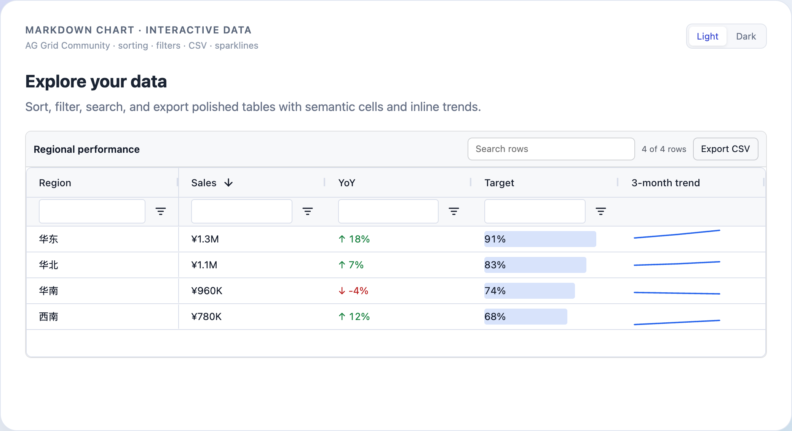

# Markdown Chart

<p align="center">
  <strong>面向 Markdown 的安全、流式图表渲染方案。</strong><br />
  将严格 JSON 代码块渲染为可交互图表、KPI 卡片和数据表格。
</p>

<p align="center">
  <a href="https://www.npmjs.com/package/@datafe-open/markdown-chart"></a>
  <a href="https://github.com/datafe/markdown-chart/actions/workflows/release.yml"></a>
  <a href="./LICENSE"></a>
</p>

<p align="center">
  <a href="./README.md">English</a> · 简体中文
</p>

<p align="center">
  
</p>

`markdown-chart` 是一个小巧、易于接入不同前端框架的 Markdown 图表工具包，
尤其适合渲染 AI 或数据应用仍在流式输出的 Markdown。它让原始数据保持可查看，
让图表配置可以跨宿主传递，也让渲染器与 Markdown 解析链路彼此解耦。

## 为什么选择 Markdown Chart？

- **为流式 Markdown 设计。** 已闭合的图表代码块会立即渲染，并在后续文本
  继续到达时保持挂载。
- **数据默认可查看。** 标准协议将数据与渲染器配置分离，自动提供图表/数据
  切换和有边界的表格视图。
- **适合承接生成内容。** 文档输入只接受严格 JSON，不执行 JavaScript，
  并对 schema、大小和图表配置设置明确限制。
- **直接接入常见技术栈。** 提供 React + react-markdown、Vue 3 + markdown-it
  组件，也可以只使用与框架无关的核心包。
- **同时覆盖图表、指标卡和表格。** 内置 ECharts 可视化、响应式多 KPI 卡片和
  基于 AG Grid Community 的数据表格。
- **可扩展但不绑定宿主。** 可以注册其它渲染器、解析应用自有数据引用，
  或由宿主处理引用点击事件。

## 快速开始

### React + react-markdown

```sh
pnpm add echarts @datafe-open/markdown-chart-react
```

````tsx
import { MarkdownChart } from '@datafe-open/markdown-chart-react';

const source = `## 月度销售额

\`\`\`markdown-chart
{
  "version": 1,
  "renderer": "echarts",
  "data": {
    "kind": "inline",
    "dimensions": ["month", "sales"],
    "source": [["1 月", 100], ["2 月", 180], ["3 月", 260]]
  },
  "spec": {
    "xAxis": { "type": "category" },
    "yAxis": {},
    "series": [{ "type": "bar", "encode": { "x": "month", "y": "sales" } }]
  }
}
\`\`\``;

export function Report() {
  return <MarkdownChart source={source} />;
}
````

这个组件会自动配置 react-markdown、ECharts、KPI 和表格渲染器。如果应用已经管理
Markdown 解析器或渲染器注册表，请参考 [React 高级示例](./examples/react/advanced/)。

### Vue 3 + markdown-it

```sh
pnpm add echarts @datafe-open/markdown-chart-vue
```

```vue
<script setup lang="ts">
import { MarkdownChart } from '@datafe-open/markdown-chart-vue';

defineProps<{ source: string; streaming?: boolean }>();
</script>

<template>
  <MarkdownChart :source="source" :streaming="streaming" />
</template>
```

Vue 组件会自动配置 markdown-it 和同一组内置渲染器。完整可运行工程见
[简单与高级示例](./examples/)。

## 可以渲染什么？

### 交互式表格

使用 `renderer: "table"` 展示需要直接探索的数据。AG Grid Community 提供类型化
排序与筛选、快速搜索、虚拟滚动和冻结列。搜索从底部状态栏按需展开，列筛选从表头打开，
默认不展示筛选输入行，也不提供导出入口。结构化 cell 配置还能展示
变化方向、条形、进度和内联 SVG 小趋势图，不依赖 AG Grid Enterprise。

<p align="center">
  <picture>
    <source media="(prefers-color-scheme: dark)" srcset="./docs/images/markdown-chart-table-dark.png">
    
  </picture>
</p>

````markdown
```markdown-chart
{
  "version": 1,
  "renderer": "table",
  "data": {
    "kind": "inline",
    "source": [
      { "region": "华东", "sales": 1280000, "growth": 0.18, "apr": 31, "may": 36, "jun": 42 },
      { "region": "华南", "sales": 960000, "growth": -0.04, "apr": 27, "may": 26, "jun": 25 }
    ]
  },
  "spec": {
    "title": "区域销售",
    "columns": [
      { "field": "region", "title": "区域", "pinned": "left" },
      { "field": "sales", "title": "销售额", "type": "number", "format": { "style": "currency", "currency": "CNY", "notation": "compact" } },
      { "field": "growth", "title": "同比", "type": "number", "format": { "style": "percent" }, "cell": { "kind": "change", "polarity": "higher-is-better" } },
      { "id": "trend", "title": "近三月", "cell": { "kind": "sparkline", "fields": ["apr", "may", "jun"], "scale": "column" } }
    ]
  }
}
```
````

标准表格数据的 Data 面板也会按需加载同一套交互表格。加载失败时仍显示 core
提供的有界 HTML 表格。表格默认最多接收 10,000 行和 200,000 个物化单元格（行数乘以源字段并集），
自动推断列最多 50 个；宿主可以下调行数和单元格限制。

### ECharts 图表

使用 `renderer: "echarts"`，通过与渲染器无关的 `data` 提供数据，以严格 JSON
ECharts `spec` 提供图表配置。显式 ECharts 配置会覆盖项目的展示默认值。
Inline 数据以及由宿主 resolver 返回的引用数据都会自动获得图表/数据切换能力。

节点/连线使用 `data.shape: "graph"`，可渲染桑基图和关系图；嵌套 children 使用
`data.shape: "hierarchy"`，可渲染树图、矩形树图和旭日图。同一份 source 同时驱动
ECharts 与 Nodes/Links 或扁平层级 Data 视图，结构化 series 不再复制 data/links。

### 多 KPI 卡片

使用 `renderer: "kpi"` 展示包含 1–12 个指标的响应式卡片组。每个 KPI 可以从
共享或具名数据集中绑定值，使用结构化 `Intl.NumberFormat` 配置格式化数值，
展示语义状态与折线/面积趋势，并按需暴露由宿主处理的引用入口。

````markdown
```markdown-chart
{
  "version": 1,
  "renderer": "kpi",
  "data": {
    "kind": "inline",
    "source": [
      { "day": "2026-09-01", "conversion": 0.38, "revenue": 16800000 },
      { "day": "2026-09-02", "conversion": 0.42, "revenue": 18000000 }
    ]
  },
  "spec": {
    "timeField": "day",
    "items": [
      {
        "id": "conversion",
        "title": "转化率",
        "value": { "field": "conversion", "format": { "style": "percent" } },
        "trend": { "type": "area", "compare": { "lag": 1, "mode": "absolute" } }
      },
      {
        "id": "revenue",
        "title": "营收",
        "value": {
          "field": "revenue",
          "format": { "style": "currency", "currency": "CNY", "notation": "compact" }
        }
      }
    ]
  }
}
```
````

## 流式渲染

在 token 仍在到达时，把外层文档状态传给组件：

```tsx
<MarkdownChart source={source} streaming={isStreaming} />
```

```vue
<MarkdownChart :source="source" :streaming="isStreaming" />
```

代码块一旦闭合就会立即渲染。只有文档末尾尚未闭合的活动代码块会继续等待；
解析、数据解析或图表运行时挂载尚未完成时，会展示内置 loading 状态。

## 由宿主管理的数据与操作

标准数据既可以直接 inline，也可以使用 `dataset://forecast` 这类不透明引用。
项目本身不会选择传输方式，也不会主动请求引用；宿主负责校验引用并提供 resolver。
KPI 引用入口遵守同一边界：渲染器只转发不透明事件，由宿主决定是否以及如何打开。

因此，应用的数据访问、鉴权、页面跳转和领域协议都留在公共渲染器之外。

ECharts renderer 默认最多接收 100,000 行、1,000,000 个单元格和 1,200,000
个 JSON 节点。该预算面向通过 `data.kind: "ref"` 或宿主适配器解析的窄表趋势
数据；core Markdown fence 仍受独立输入限制，不用于直接内嵌 100,000 行数据。
资源预算更紧的宿主可通过 `createEChartsRenderer({ limits })` 下调任一限制。

Core 另外将结构化数据默认限制为 2,000 个节点、4,000 条 graph 连线和 20 层
hierarchy。宿主通过 `new ChartRendererRegistry({ dataLimits: { ... } })` 调整这些预算；
ECharts 既有 table 行/单元格限制保持不变。

## 包说明

| 包 | 用途 |
| --- | --- |
| [`@datafe-open/markdown-chart`](https://www.npmjs.com/package/@datafe-open/markdown-chart) | 与框架无关的注册表、标准解析器、数据视图和生命周期控制器 |
| [`@datafe-open/markdown-chart-echarts`](https://www.npmjs.com/package/@datafe-open/markdown-chart-echarts) | 严格 JSON ECharts 渲染器 |
| [`@datafe-open/markdown-chart-kpi`](https://www.npmjs.com/package/@datafe-open/markdown-chart-kpi) | 响应式多 KPI 渲染器 |
| [`@datafe-open/markdown-chart-table`](https://www.npmjs.com/package/@datafe-open/markdown-chart-table) | 基于 AG Grid Community 的交互表格渲染器与 Data 视图 provider |
| [`@datafe-open/markdown-chart-markdown-it`](https://www.npmjs.com/package/@datafe-open/markdown-chart-markdown-it) | markdown-it 占位插件和环境通道 |
| [`@datafe-open/markdown-chart-react`](https://www.npmjs.com/package/@datafe-open/markdown-chart-react) | React + react-markdown 组件和适配器 |
| [`@datafe-open/markdown-chart-vue`](https://www.npmjs.com/package/@datafe-open/markdown-chart-vue) | Vue 3 + markdown-it 组件和 composable |

## 文档

- [协议规范](./SPEC.md)
- [安全模型与支持的 ECharts 配置范围](./SECURITY.md)
- [可运行示例](./examples/)
- [React 包接入指南](./packages/react/README.md)
- [Vue 包接入指南](./packages/vue/README.md)
- [发布流程](./RELEASING.md)

## 本地开发

```sh
pnpm install
pnpm test
pnpm typecheck
pnpm build
pnpm check:pack
```

欢迎提交 Issue 和 Pull Request。可发布包的变更使用 Changesets；根目录构建也会
验证全部 React 和 Vue 示例。

## 许可证

MIT。部分实现改编自采用 Apache-2.0 许可证的 Qwen Code，详见
[第三方声明](./THIRD_PARTY_NOTICES.md)。
